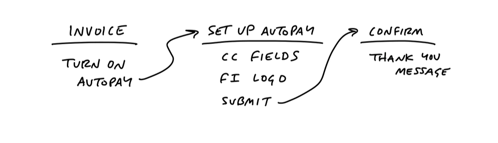
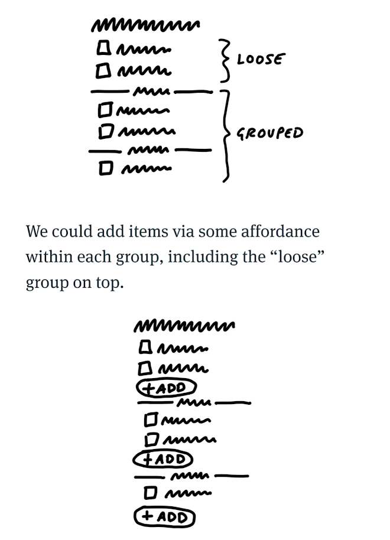
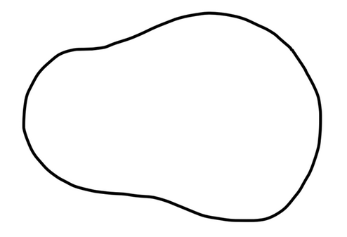
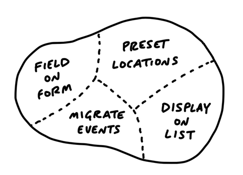
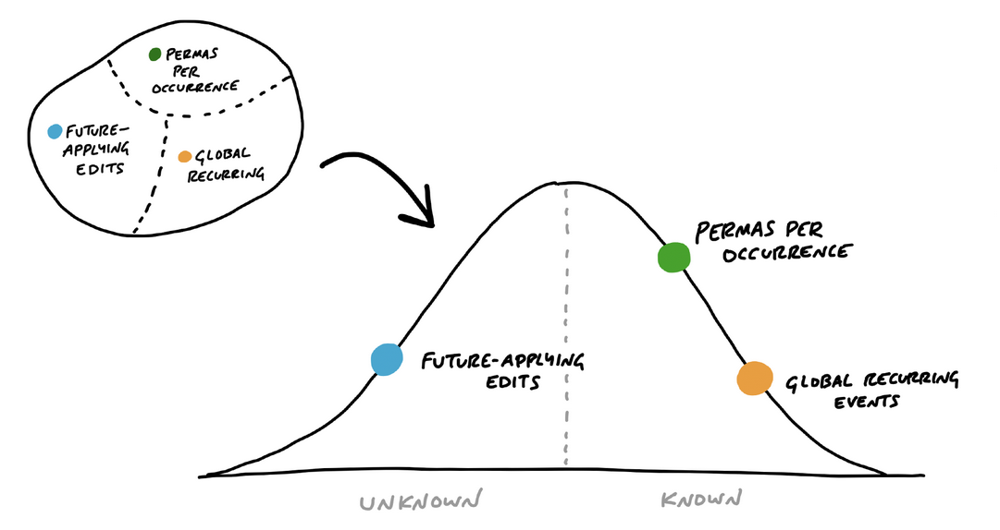

## Shaping

### Set boundaries

- Define the appetite
  - time budget for a standard team size
  - two sizes:
    - small batch: doable in one or two weeks (combine multiple into a full cycle)
    - big batch: full cycle
  - too big: reduce scope or break up into multiple projects

### Find the elements

- Questions we're trying to answer
  - Where in the current system does the new thing fit?
  - How do you get to it?
  - What are the key components or interactions?
  - Where does it take you?
- Breadboarding
  - List components and wiring without design
  - Types of components
    - Places: things you can navigate to, like screens, dialogs, pop-up menus
    - Affordances: things the user can acto on, like buttons and fields.
      - Interface copy is an affordance too: users can read it to gain information
    - Connection lines: show how the affordances take the user from place to place
  - Use words only
  - Can specify types of affordances (button, checkbox, etc.) but not more (position)
  - 
- Fat marker sketches (FMS)
  - Not mandatory
  - Sketch with very broad strokes such that adding details is very hard or impossible
  - Added risk of getting attached to a design
  - Why so specific type of sketch: too easy to go to wrong level of detail otherwise
  - 
- Elements are the output
  - Summarize breadboard and FMS in simple acceptance criterias
- Breadboards and FMS leave room for designers without influencing them with too specific details
- Lists of elements are not deliverable; project can still be abandonned

### Risks and Rabbit Holes

- Shaped up work is a think tail of risks
- Look for rabbit holes
  - Take a slow look at the project while looking for risks and unforeseen complications
  - Ex: walk through a use case in slow motion, step by step
  - Ask questions like
    - Does this require new technical work we've never done before?
    - Are we making assupmtions about how the parts fit together
    - Are we assuming a design solution exists that we couldn't come up with ourselves?
    - **Is these a hard decision we should settle in advance so it doesn't trip up the team?**
      - If so, make a decision now
      - Find the compromise and explain the tradeoff
      - Leaving holes up to the team risks them spending days on a solution that isn't necessary
  - Look for related use cases and specify which are out of bounds
  - Cut back unnecessary features. Add them as nice to haves if you want, buth the assumption is the project is valuable without it
  - Present to technical experts
    - Get a single preson to challenge your idea
    - Ask if this is doable within your appetite (the timeframe you're thinking about)
    - Ideally, take them through your whole thinking process. Get a whiteboard and re-do the whole breadboard, FSM and holes you patched up
    - If some major problems arise, go back to shaping

### Write the pitch

- Ingredients:
  - 1: Problem
    - Helps make sure the solution solves a real problem
    - A defined problem can be prioritized
    - How much you spell out the problem varies on a case by base basis
  - 2: Appetite
    - Helps keep discussions focused and avoid scope creep
  - 3: Solution
    - A problem without a solution is unshaped work
    - It's important to make sur the stakeholders can "get" the idea quickly
      - Breadboards and FMSs are too dense for anyone who didn't participate in the discussion that created them
      - Need to make the idea more concrete, but still without boxing it in a specific implementation
        - Embedded sketches: embed a sketch into a screenshot of the application
          - Might need to add a little detail, but be sure to call out that designers are still free to come up with other designs
          - 
          - 
        - Annotated FMS: Annotate your FMS to make it more understandable by people with less context
          - 
          - 
  - 4: Rabbit holes
    - Address the rabbit holes you identified previously
    - A couple of sentences can be enough, as long as the hole is called out explicitely
  - 5: No gos
    - Specify what has already been decided is out of scope
  - Pitch examples:
    - [Grouping TO-DOs](pitch-examples/grouping-to-dos.pdf)
    - [Groups, clarified](pitch-examples/groups-clarified.pdf)
  - People comment on the pitch asynchronously, not to say yes or no, but to poke holes or contribute missing information

## Betting

### Bets, Not Backlogs

- No backlogs
  - Demoralizing (you're never gonna get through it all)
  - Wastes time revising and refining
- Betting meeting between each cycle
  - Only consider pitches from the last cycle, or those someone purposefully brought back
  - Infrequent + narrow focus = high productivity
  - Pitches are evaluated and bets are chosen for the next cycle
- If a pitch doesn't make it, anyone is free to track it by themselves and bring it back in another betting table
- One-on-ones between departments help pollinate ideas
- Everyone can use their own method to track things (rather than a standard that works for nobody)
- When ideas come back, they have context and motivation

### The Betting Table

- Six week cycles
  - Just right to have enough time to ship meaningful stuff, but deadline is close enough that people feel the pressure to be efficient
  - The shorter the cycle, the higher the relative cost of planning
- Cool-down
  - Cool-down period of two weeks between each cycle
  - No scheduled work, everyone is free to spend their time as they wish
- Team and project sizes
  - Teams are one designer + 1 or 2 devs
  - 1 QA later on in the cycle
  - Each team can work on a big batch or multiple small ones
  - Small batch teams can schedule their projects as they wish within the cycle
- The betting table
  - Only pitches shaped in last six weeks and one or two pitches someone brough back
  - Few stakeholders (CEO, CTO, senior programmer, product strategist)
  - Rarely goes over an hour or two
  - Everyone hase reviewed the pitches beforehand
  - Output of the meeting is called the "cycle plan"
  - Highest decision makers are present. No other approval is needed.
- The meaning of a bet
  - Bets have a payout. Each bet has a concrete outcome within a single cycle.
  - Bets are a commitment. A bet for 6 weeks = team gets 6 dedicated weeks with no interruptions.
  - Bets have caps on downsides. Most you can lose is 6 weeks.
- Uninterrupted time
  - What matters is momentum
  - Even a few hours is costly because it breaks momentum
  - If something "important" comes up during the cycle, nothing changes. If it's really important, it can be bet on in the next cycle.
  - In case of a real crisis, the cycle can be interrupted. But real crises are rare.
- The circuit breaker
  - If work isn't finished within the cycle, there's no extension by default
  - No risk of a project getting carried away
  - If it didn't fit in six weeks, it's an opportunity to re-shape and present a new pitch
  - Increases team ownership: they're responsible for shipping and they're empowerd to choose the tradeoffs
- What about bugs?
  - Bugs aren't automatically more important than other tasks
  - Most bugs can wait 6 weeks (or much longer)
  - Three strategies for dealing with bugs:
    1. Use cool-down
    2. Bring it to the betting table
    3. Bug smash: Once a year, dedicate a cycle to fix bugs. Holidays work great for this because it's hard to plan a cycle with lots on vacation and travel
- Keep the state clean
  - No work gets carried over between cycles
  - Even if you have a roadmap in your head, keep it in your head
  - Keep the flexibility to change goals between cycles
  - If something doesn't fit in a cycle, break it down into something that does
    - If the first cycle goes well, be glad and bet on the next step in the next cycle

### Place your bets

- Look where you are
  - Two types of product: existing and new
    - Existing products follow the standard Shape Up process
      - Have constraints in place (design, features) that the new work needs to fit into
    - New products are split in three modes:
      1. R&D mode
         - Cycles don't have output, they're spikes (some UI and foundational code is commited at best)
         - Shaping is much more loose (we expect to learn by building): bet on the time to invest on each spike rather than what the outcome should be
         - Work is done by the senior team (CTO and either CEO/designer or other senior designer)
           - Can't delegate when you don't even know what you want
           - Team must hold the vision of the product to properly evaluate the long-term effects of decisions
         - Still work one cycle at a time (Each cycle may be the last)
      2. Production mode
         - Mostly like working on an exsiting product
         - Shaping is done fully again
         - Product teams do the work instead of the senior team
         - Goal goes back to shipping outcomes instead of sprints, but shipping means "merging with the intention not to touch again"
           - There are no customers, so it's still pretty easy to cut stuff
      3. Cleanup mode
         - Fix every little thing that accumulated during the other modes (bugs, small forgotten details, last minute improvements)
         - No shaping (more like a bug smash)
         - Free-for-all: no teams, no bets
         - Work is shipped in as small bites as possible
         - Still important to be disciplined and critical about the value of what we're doing
         - Last opportunity for leadership to do some final cuts
         - Shouldn't last more than two cycles
  - Questions to ask
    - Does the problem matter
      - Is this problem more important than all the others?
      - Is this problem putting unseen burden on a segment of customers or internal department?
    - Is the appetite right?
      - A stakeholder saying they're not interested in spending the time proposed can lead to a few outcomes:
        - The problem isn't articulated well enough and there's impact or context that can be added
        - They're saying no to something else. Asking "would you be confident if we did it in two weeks" can unearth those other blockers.
        - Shaper abandons the idea if interest is too low
        - Shaper goes back to shaping to present a better plan next time
    - Is the solution attractive?
      - Sometimes the proposed solution isn't ideal
      - Design suggestions can be discussed right away, but only for a very short time (not the purpose of the meeting)
    - Is this the right time?
      - Maybe it's been too long since shipping the last feature
      - Maybe we've shipped too many features and need to focus on customer requests
      - Maybe we need to change up the type of work to maintain team morale
    - Are the right people available?
      - The betting table assigns specific people to the cycle-teams based on the expertise needed for a given project
      - Outside of expertise, maybe someone just has a particular interest for the project, or wants to do a big batch after a couple cycles of small batches
      - Always need to account for vacations, etc.
      - Some companies let people choose the teams, depends on your culture
  - Post the kick-off message
    - After the meeting, someone from the betting table writes a kick-off message to inform everyone of the chosen bets and who will be working on them

## Building

### Hand Over Responsibility

- Assign projects, not tasks
  - Teams are responsible for splitting tasks and managing the project as they see fit
  - Keeps the team aligned on the end goal
  - Teams aren't left to do anything, the work is still shaped
  - That's where the right levels of abstraction pay off: the experts on the team will make better decisions than possible during shaping
- Done means deployed
  - Must be depolyed within 6 weeks
  - QA must be done within 6 weeks
  - Docs, marketing, etc. can be done later (usually by another team)
  - Kick off
    - Publish the concept document (initial pitch or a distilled version of it)
    - Prepare a kickoff meeting to ask important clarification questions
- Getting oriented
  - Nothing visible gets done in the first few days
  - Team members are exploring the existing constaints (code and design) and figuring out dead ends/extension points
  - Interrupting them to ask for status updates only slows them down (empower the team to say they's still figuring stuff out)
  - Can start asking questions if it takes more than 3 days
- Imagined vs discovered tasks
  - Imagined tasks are those we come up with at the start
  - Discovered tasks is everything els
  - Discovered tasks make up the bulk of the project (and often the biggest challenges)
  - The only way to find the discovered tasks is to start working

### Get One Piece Done

- Integrate one slice
- Programmens don't need to wait
  - Programmers don't need to wait for design to start working
  - Because the work is shaped up, programmers should know enough about the core functionality to start working backend
  - Meanwhile, designers can start exploring some stuff on their own and loop back with devs when some piece is ready
- Affordance before pixel-perfect screens
  - Programmers don't need detail mockups to start implementing the core functionality
  - Usually, basic HTML elements with a tiny bit of styling is faster and good enough (morke like a breadboard)
  - The core business requirements should still be visible (enough to discover and make decisions on tradeoffs)
  - First design should be quick to implement so you can start experimenting quickly
  - Design details (alignment, colors, etc.) are easy to adjust later
- Program just enough for the next step
  - In the backend as well, many things can be skipped to get a first usable version faster
    - Controllers without models
    - Models with hardcoded data
    - Basic auth with hardcoded password instead of actual auth
- Start in the middle
  - Start with the most interesting problem first
  - Three criterias to choose what to do first:
    - It should be core: start with the functionality without which nothing else makes sense; the edges are often more simple (data entry and display, etc.)
    - It should be small: the point is to finish something quickly to build momentum
    - It should be novel: if all else is equal, start with what you've never done before to remove uncertainty

### Map The Scopes

- Prefer organizing by slice rather than people to avoid having a bunch of disparate pieces that don't fit together
- Each slice is called a scope
- The socpe map
  - At the begging, there's just the outline of the whole project 
  - When the team takes on the project, it starts discovering tasks. It's too early to try and group them, as any grouping would be imagined. 
  - As the team keeps working, it can start to group related tasks together into scopes 
- Scopes should represent meaningful parts of the project that can be completed independently and quickly (a few days
  )
- Scopes should correspond to the language of the project (the domain vocabulary)
- Different parts of the team can work on different scopes at the same time
- Scopes should evolve (be split, gain tasks) as the project goes on
- Don't expect to see accurate scopes at the start of the project. The team needs time (about a week) to do some real work and start discovering them.
- How to know if scopes are right:
  1. You have a good high level view of the project and nothing important is hidden in the details
  2. The scopes naturally come up in conversations about the project
  3. It's easy to put know where to put new tasks as they come up
- How to know if scopes are _not_ right:
  1. It's hard to say how "done" a scope is. Happens when the tasks in the scope are unrelated. Completing one doesn't get you closer to a common goal.
  2. They aren't unique to the project. "Back-end", "front-end" or "bugs" are grab bags. They're never "done" until the whole project is.
  3. It's too big to finish in a couple of days.
- Types of scopes:
  - Layer cakes: vertical stack of thin layers that all match closely to each other. Common in information system projects.
  - Icebergs: Where different parts of the stack within a scope are very differently sized. Might make sense to split into multiple scopes that aren't all full vertical slices to keep the size down.
    - Always be skeptical of icebergs. Is the complexity really necessary? Is there a different approach that could be socped differently?
  - Chowder: a single catch-all scope for tasks that don't fit anywhere else. Always be critical of what's in there. Shouldn't contain more than a couple tasks.
- Mark nice-to-haves explicitely, so it's always obvious what's critical and what's not

### Show Progress

- Showing progress with tasks is inneffective because you don't know what you don't know: you can't count the tasks that haven't been discovered yet.
- Estimates are useless because they lack context
- The hill: each socpe, like a hill, has two side. The uphill side is where you figure out what to do and deal with uncertainty. On the downhill side, you have a good view of everything that needs to be done and all that's left is to do it.
- You can map scopes on the hill, with the right side being downhill (rightmost scopes are closest to being done) 
- Anyone can look at the hill and have an instant view of the status of the project
  - Even more powerful if you can see the evolution of the hill over time. Allows you to see what hasn't moved in a while (usually uphill) and take action if necessary.
- Looking at scopes on a hill means it's not about why person X hasn't progressed on their task, it's about why scope Y hasn't moved. Removes pressure and blame. ("Looks like you're stuck" vs. "How can we get this over the hill")
- Sometimes, an unmoving scope is a sign that it needs to be split. Maybe the scoped hasn't moved, but there are actually parts within it that are already over the hill, or even done.
- Avoiding backsliding: backsliding happens when the uphill work is done theoretically, but unknown unknowns come up during the work. You can conceptually split the uphill phase in three thirds:
  1. "I've thought about this"
  2. "I've validated my approach"
  3. "I'm far enough with what I've built that I don't believe there are other unknowns"
- Focus on getting any critical/risky work over the hill before getting stuff back down. Finishing touches should be left for the end of the project.

### Decide When to Stop

- Compare to baseline rather than ideal
  - How much progress have you made?
  - Is it worth it to make the customers wait longer?
  - "Never good enough" vs. "Better than what they have now"
- Limits motivate trade-offs
- QA isn't a gate, it's an enabler for the next level of quality
  - The basis of quality comes from the team itself
  - Everything QA finds is a nice-to-have by default
  - The teams can triage and promote as necessary
  - Best to use a separate list for QA items and move them in the main list as necessary
- May only extend a project if:
  1. Remaining tasks are true must-haves that have survired rigorous scope hammering
  2. Everything that's left is downhill
  - Unknowns are too risky, better to go back to shaping and wait for the next cycle
- Usually don't extends even if criterias are met
  - Cool-down can be used to tie loose ends, but only exceptionally (if too frequent, the problem lies in shaping)

### Move On

- Don't take customer feedback too close to heart
- Customer requests and feedback that arise after a release are input for a new round of shaping

## Appendices

### Adjust to your size

- Base concepts exist regardless of size: shaping (trade-offs, rabbit holes), betting (fixed appetites, complete focus), building
- Small enough to wing it
  - In small teams, everyone wears multiple hats
  - Be deliberate about the hat you're currently wearing
  - Most structure is superfluous
    - Be flexible with cool-down, cycle duration, pitches, betting table, etc.
- Big enough to specialize
  - With bigger teams, structure becomes primordial
  - Create specialized teams (ops, platform, support, product) to liberate the core team and let them focus of projets

### How to begin to Shape Up

- Option A: One six-week experiment

  1. Shape a six-week project. Be conservative, you're probably underestimating
  2. Get a team of one designer and two programmers. Guarantee they won't be interrupted.
  3. No betting table. Just plan for the team to do the one project.
  4. Kickoff the project with a presentation and let them make their tasks.
  5. Give the team a dedicated space or channel to work closely together
  6. Encourage the team to Get One Piece Done

  Don't worry about scopes or showing progress. Just profit from the dedicated uninterrupted time.
  Once the project is completed successfully, use it as a case study to expand Shape Up.

- Option B: Start with shaping

  Even if you can't dedicate a team for a complete cycle, start by focusing on shaping and then build through your existing process.
  Shaping by itself will bring benefits and empower the teams.

- Option C: Start with cycles

  Keep the current process, but try to work in six-week cycles. The lower management overhead will give the teams more breating room and let them naturally come to shaping to better utilize their time.

- Fix shiping first
  - No point in having a great shaping process if you can't ship features
- Focus on the end result
  - Don't worry about giving the teams too much freedom
  - Instead of trying to optimize every individual's time, focus on the goal. How will you feel if you ship your bet after 6 weeks?
